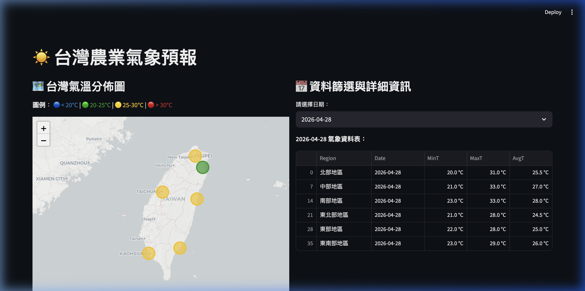

# 台灣農業氣象預報 (Taiwan Agricultural Weather App)

這是一個使用 Python、Streamlit、Folium 搭配 CWA 氣象局 API (F-A0010-001) 所開發的台灣農業氣象預報系統。此應用程式會自動擷取最新的氣象資料（最高溫、最低溫），存入 SQLite3 資料庫中，並在網頁介面上以動態地圖及表格呈現。

## 🌐 網站 Demo

**線上 Demo 網址:** [點此查看 Demo (Streamlit Cloud)](https://hw2-web-app-hhm5pytxy3j5vi36fcf7ga.streamlit.app/)

## 網頁介面預覽


## 🚀 專案特點
- **即時資料擷取**: 自動呼叫 CWA 氣象資料開放平台 API。
- **SQLite3 儲存**: 自動建立 `data.db` 資料庫，結構化儲存氣象預報。
- **互動式地圖 (Folium)**: 透過 Streamlit 與 Folium 在左側展示各區域的平均氣溫（並依照溫度以不同顏色標示）。
- **資料分析與篩選**: 右側支援日期選擇器，動態更新各區域的詳細溫度資料。

## 🛠 本地執行指南

1. **安裝環境**:
   請確認您已安裝 Python 3。接著建立虛擬環境並安裝所需套件：
   ```bash
   sh run.sh
   ```
   *這將自動建立 `venv`、安裝相依套件、抓取資料並啟動伺服器。*

2. **手動啟動**:
   若 `data.db` 已建立且只想啟動網頁伺服器：
   ```bash
   streamlit run app.py
   ```


